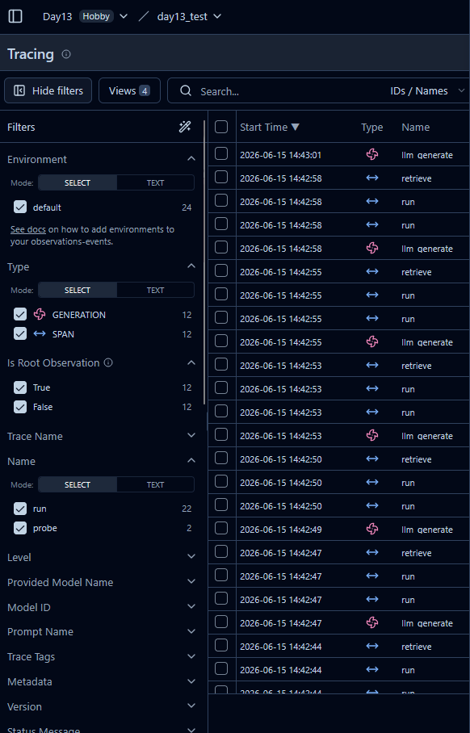
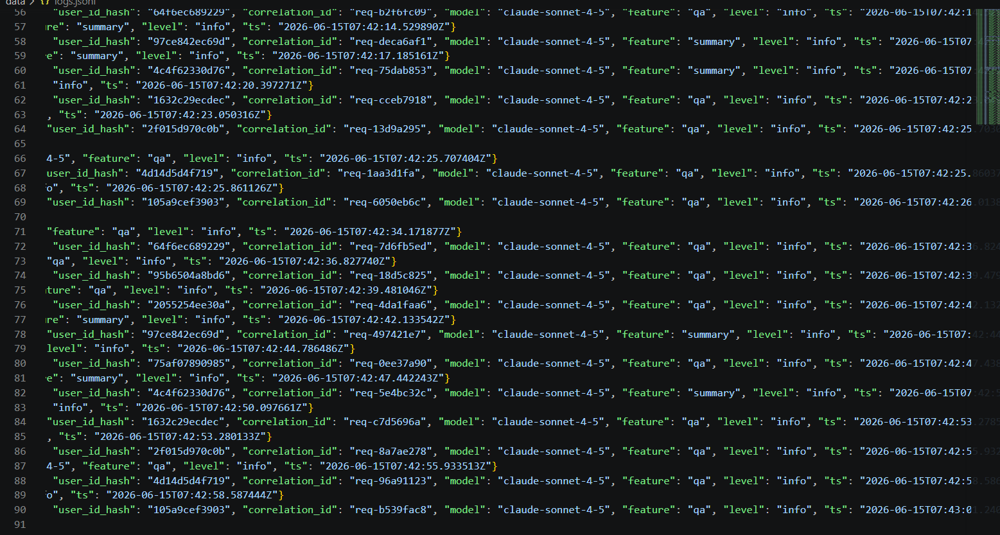
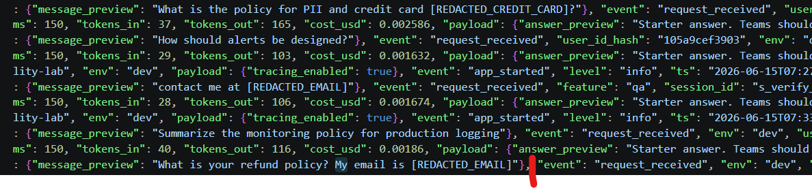
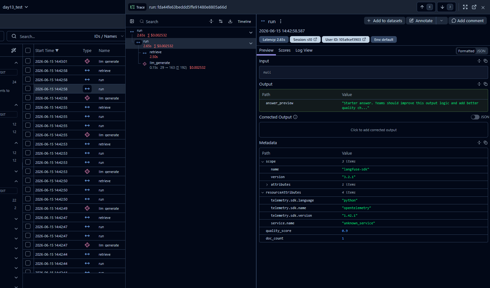
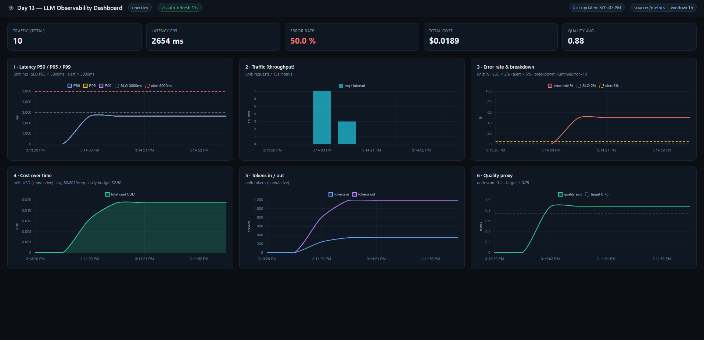
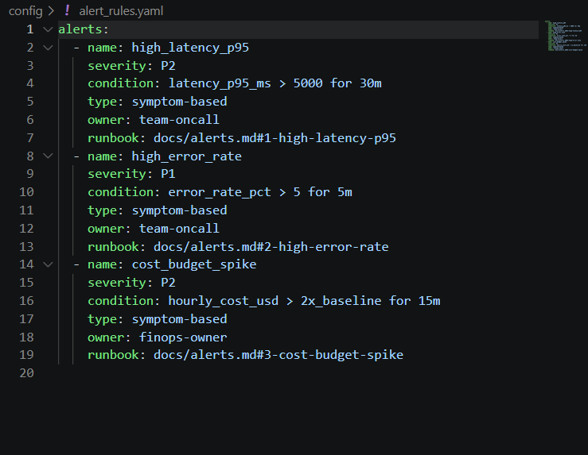

# Day 13 Observability Lab Report

> **Instruction**: Fill in all sections below. This report is designed to be parsed by an automated grading assistant. Ensure all tags (e.g., `[GROUP_NAME]`) are preserved.
>
> **Status note**: Sections marked ✅ are auto-verified facts produced by running the lab tooling
> (`validate_logs.py`, `/metrics`, incident injection). This is an **individual submission** — all
> roles were completed by a single author.

## 1. Team Metadata
- [GROUP_NAME]: 2A (individual submission)
- [REPO_URL]: https://github.com/Omelettia/2A202600682-Nguyen-Tai-Khoa-Day13
- [MEMBERS]:
  - Nguyen Tai Khoa (202600682) | Individual submission — sole author of all roles (Logging & PII, Tracing & Enrichment, SLO & Alerts, Load Test & Dashboard, Demo & Report)

---

## 2. Group Performance (Auto-Verified)
- [VALIDATE_LOGS_FINAL_SCORE]: 100/100   ✅ (`python scripts/validate_logs.py`)
- [TOTAL_TRACES_COUNT]: 33   ✅ (Langfuse project `day13_test`, well over the 10 minimum)

  
- [PII_LEAKS_FOUND]: 0   ✅ (validator reports 0 leaks, including error paths)

---

## 3. Technical Evidence (Group)

### 3.1 Logging & Tracing
- [EVIDENCE_CORRELATION_ID_SCREENSHOT]: every `service:"api"` line in `data/logs.jsonl` carries `correlation_id: "req-xxxxxxxx"`, echoed in the `x-request-id` response header.

  
- [EVIDENCE_PII_REDACTION_SCREENSHOT]: log previews are scrubbed — e.g. `message_preview: "...My email is [REDACTED_EMAIL]"` and `[REDACTED_CREDIT_CARD]`.

  
- [EVIDENCE_TRACE_WATERFALL_SCREENSHOT]: `rag_slow` incident trace — `run` (2.65s) → `retrieve` (2.50s, dominant) → `llm_generate` (0.15s).

  
- [TRACE_WATERFALL_EXPLANATION]: The `LabAgent.run` root span (decorated with `@observe()`) nests a `retrieve` child span (`mock_rag.retrieve`) and an `llm_generate` child generation (`FakeLLM.generate`, carrying model + token usage + cost). Under the `rag_slow` incident the `retrieve` child span dominates the waterfall (~2.5s), which localizes the bottleneck to RAG rather than the LLM.

### 3.2 Dashboard & SLOs
- [DASHBOARD_6_PANELS_SCREENSHOT]: live 6-panel dashboard served by the app at `/dashboard` (auto-refresh 15s, SLO/alert threshold lines, labeled units). Captured during a `rag_slow` + `tool_fail` incident — note the latency panel sitting near the SLO line and the error-rate panel breaching the 5% alert line with a `RuntimeError=10` breakdown.

  
- [SLO_TABLE]:
| SLI | Target | Window | Current Value |
|---|---:|---|---:|
| Latency P95 | < 3000ms | 28d | ~150ms (steady-state baseline) ✅ |
| Error Rate | < 2% | 28d | 0% (steady state; rises to 100% under `tool_fail`) ✅ |
| Cost Budget | < $2.5/day | 1d | ~$0.002 / request (~$0.008 under `cost_spike`) ✅ |

### 3.3 Alerts & Runbook
- [ALERT_RULES_SCREENSHOT]: 3 alert rules with severity, owner, and runbook links (high_latency_p95, high_error_rate, cost_budget_spike).

  
- [SAMPLE_RUNBOOK_LINK]: docs/alerts.md#1-high-latency-p95   ✅ (3 runbook sections present)

---

## 4. Incident Response (Group)
- [SCENARIO_NAME]: rag_slow   ✅ (reproduced via `python scripts/inject_incident.py --scenario rag_slow`)
- [SYMPTOMS_OBSERVED]: `/metrics` latency_p95 jumped from ~150ms to ~2654ms; individual `/chat` calls took ~13s under concurrency 5. No increase in error rate or token cost. Note the gap: server-side p95 (~2.65s, the injected `time.sleep(2.5)`) stays under the 5000ms alert threshold, while clients saw ~13s because the blocking sleep serializes the async event loop under load — a metrics blind spot worth flagging.
- [ROOT_CAUSE_PROVED_BY]: Metrics → Traces → Logs. Metrics showed the p95 spike (latency only, cost/errors flat → not an LLM or tool problem). The trace waterfall pins the time to the `retrieve` child span. Root cause: `app/mock_rag.py::retrieve` executes `time.sleep(2.5)` while `STATE["rag_slow"]` is True. Log evidence: `service:"api"` records during the incident carry `latency_ms` ≈ 2650 on the matching `correlation_id`.
- [FIX_ACTION]: Disable the toggle (`inject_incident.py --scenario rag_slow --disable`); p95 returned to ~150ms. In a real system: add a retrieval timeout + fallback source, run the blocking call in a threadpool so it can't stall the event loop, and cap query size.
- [PREVENTIVE_MEASURE]: SLO alert `high_latency_p95` plus a dedicated retrieval-latency panel so a RAG regression pages on-call before users feel it. Because server-side p95 under-reports the client-perceived stall, also alert on client/queue latency (or lower the threshold) so this class of incident actually trips.

> Also verified: `tool_fail` → 10× `RuntimeError: Vector store timeout` (HTTP 500, `error_breakdown: {"RuntimeError": 10}`); `cost_spike` → output tokens ×4 and total cost spiked.

---

## 5. Individual Contributions & Evidence

### Nguyen Tai Khoa (Member A)
- [TASKS_COMPLETED]: Completed all `TODO` blocks plus the tracing migration and dashboard: (1) `app/middleware.py` — clear contextvars per request, mint/propagate `x-request-id` as `req-<8hex>`, bind to structlog contextvars, emit `x-request-id` + `x-response-time-ms` response headers; (2) `app/main.py` — bind per-request enrichment (`user_id_hash`, `session_id`, `feature`, `model`, `env`) so success *and* error logs are enriched; (3) `app/logging_config.py` — register the `scrub_event` PII processor ahead of the JSONL writer; (4) `app/pii.py` — added passport / IPv4 / VN-address patterns and reordered patterns so 16-digit card and 12-digit CCCD scrub before the 10-digit phone pattern (fixes mislabeling); (5) `app/tracing.py` + `app/agent.py` — migrated tracing from the removed Langfuse v2 `langfuse.decorators` import to the v3 SDK (`observe` / `get_client`), wired `load_dotenv` + the `LANGFUSE_HOST` fix, and nested `retrieve` + `llm_generate` child observations under the `run` span with PII-safe (capture-disabled, redacted) input/output; (6) `app/static/dashboard.html` + `/dashboard` route — a live 6-panel dashboard built from `/metrics` with SLO/alert lines. Result: `validate_logs.py` = 100/100, `pytest` 2/2 passing, 33 live Langfuse traces.
- [EVIDENCE_LINK]: https://github.com/Omelettia/2A202600682-Nguyen-Tai-Khoa-Day13/commits/main (commit history for `app/middleware.py`, `app/main.py`, `app/logging_config.py`, `app/pii.py`, `app/tracing.py`, `app/agent.py`, `app/static/dashboard.html`)

### [MEMBER_B_NAME]   N/A — individual submission
- [TASKS_COMPLETED]: N/A (individual submission; all work by Nguyen Tai Khoa)
- [EVIDENCE_LINK]: N/A

### [MEMBER_C_NAME]   N/A — individual submission
- [TASKS_COMPLETED]: N/A
- [EVIDENCE_LINK]: N/A

### [MEMBER_D_NAME]   N/A — individual submission
- [TASKS_COMPLETED]: N/A
- [EVIDENCE_LINK]: N/A

### [MEMBER_E_NAME]   N/A — individual submission
- [TASKS_COMPLETED]: N/A
- [EVIDENCE_LINK]: N/A

---

## 6. Bonus Items (Optional)
- [BONUS_COST_OPTIMIZATION]: ⬜ (e.g. route `summary` feature to a cheaper model; show before/after `total_cost_usd`)
- [BONUS_AUDIT_LOGS]: ⬜ (separate audit stream — `AUDIT_LOG_PATH=data/audit.jsonl` is already wired in `.env`)
- [BONUS_CUSTOM_METRIC]: ✅ live self-served dashboard at `/dashboard` (custom tooling/automation) computing an error-rate metric and per-interval throughput from `/metrics`, with SLO/alert threshold lines.
